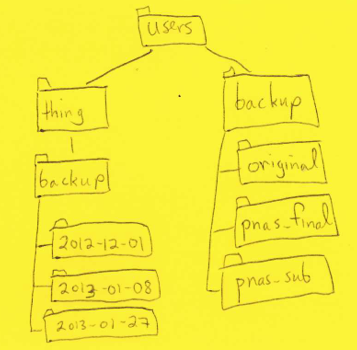

## Getting around

#### Summary

* The file system is responsible for managing information on disk.
* Information is stored in files, which are stored in directories (folders).
* Directories can also store other directories, which forms a directory tree.
* `/` on its own is the root directory of the whole filesystem.
* A relative path specifies a location starting from the current location.
* An absolute path specifies a location from the root of the filesystem.
* Directory names in a path are separated with `/` on Unix, but `\` on Windows.
* '..' means "the directory above the current one"; '.' on its own means "the current directory".
* Most file names are something.extension; the extension isn't required, and doesn't 
  guarantee anything, but is normally used to indicate the type of data in the file.
* `cd` path changes the current working directory.
* `ls path` prints a listing of a specific file or directory; `ls` on its own lists the 
  current working directory.
* `pwd` prints the user's current working directory
* Most commands take options (flags) which begin with a '-'


#### Challenges

Refer to the sketched file system when answering the following questions

  

1. If `pwd` displays `/users/thing`, what will `ls ../backup` display?  
  a. `../backup: No such file or directory`  
  b. `2012-12-01 2013-01-08 2013-01-27`  
  c. `2012-12-01/ 2013-01-08/ 2013-01-27/`  
  d. `original pnas_final pnas_sub`  

2. If `pwd` displays `/users/backup`, what command will display  

    original/ pnas_sub/ pnas_final/
       
  a. `ls pwd`  
  b. `ls -r -F`  
  c. `ls -r -F /users/backup`  
  d. Either b or c, but not a  

3. What does the command `cd` without a directory name do?  
    a. It has no effect  
    b. It changes the working directory to `/`  
    c. It changes the working directory to the user's home directory  
    d. It is an error  

4. We said earlier that spaces in path names have to be marked with a leading backslash 
   in order for the shell to interpret them properly. Why? What happens if we run a 
   command like `$ ls my\ thesis\ files` without the backslashes?


## Creating things

#### Summary

* Unix documentation uses '^A' to mean "control-A".
* The shell does not have a trash bin: once something is deleted, it's really gone.
* `mkdir path` creates a new directory.
* `cp old new` copies a file.
* `mv old new` moves (renames) a file or directory.
* `rm path` removes (deletes) a file.
* `rmdir path` removes (deletes) an empty directory.

#### Challenges

1. What is the output of the closing `ls` command in the sequence shown below?  

```
$ pwd
/home/thing/data
    
$ ls
proteins.dat
    
$ mkdir recombine
    
$ mv proteins.dat recombine
    
$ cp recombine/proteins.dat ../proteins-saved.dat
    
$ ls
```

2. FIX ME: More questions required.


## Pipes and filters

#### Summary

* Use wildcards to match filenames.
* '*' is a wildcard pattern that matches zero or more characters in a pathname.
* '?' is a wildcard pattern that matches any single character.
* `command > file` redirects a command's output to a file.
* `first | second` is a pipeline: the output of the first command is used as the input to
  the second.
* The best way to use the shell is to use pipes to combine simple single-purpose programs 
  (filters).
* `cat` displays the contents of its inputs.
* `head` displays the first few lines of its input.
* `sort` sorts its inputs.
* `tail` displays the last few lines of its input.
* `wc` counts lines, words, and characters in its inputs.

#### Challenges

1. If we run sort on each of the files shown on the left in the table below, 
   without the -n flag, the output is as shown on the right:

```
1    1
10   10
2    19
19   2
22   22
6    6

 1    1
10    2
 2    6
19   10
22   19
 6   22
```

Explain why we get different answers for the two files.

2. What is the difference between:

```
wc -l < *.dat
```
and:

```
wc -l *.dat
```

3. The command `uniq` removes adjacent duplicated lines from its input. For example, if 
a file `salmon.txt` contains:
```
    coho
    coho
    steelhead
    coho
    steelhead
    steelhead
```
then `uniq salmon.txt` produces:

```
    coho
    steelhead
    coho
    steelhead
```

Why do you think `uniq` only removes adjacent duplicated lines? (Hint: think about very 
large data sets.) What other command could you combine with it in a pipe to remove all 
duplicated lines?

4.  A file called animals.txt contains the following data:

```
2012-11-05,deer
2012-11-05,rabbit
2012-11-05,raccoon
2012-11-06,rabbit
2012-11-06,deer
2012-11-06,fox
2012-11-07,rabbit
2012-11-07,bear
```
Write down what lines of text pass through each pipe in the pipeline below.
```
cat animals.txt 	| 	head -5 	| 	tail -3 	| 	sort -r 	> 	final.txt
```    								

5. The command:
```
$ cut -d , -f 2 animals.txt
```
produces the following output:
```
    deer
    rabbit
    raccoon
    rabbit
    deer
    fox
    rabbit
    bear
```

What other command(s) could be added to this in a pipeline to find out what animals have 
been seen (without any duplicates in the animals' names)?


## Loops

#### Summary

* Use a for loop to repeat commands once for every thing in a list.
* Use `$name` to expand a variable (i.e., get its value).
* Do not use spaces, quotes, or wildcard characters such as '*' or '?' in filenames, as 
  it complicates variable expansion.
* Give files consistent names that are easy to match with wildcard patterns to make it 
  easy to select them for looping.
* Use the up-arrow key to scroll up through previous commands to edit and repeat them.
* Use `history` to display recent commands, and `!number` to repeat a command by number.

#### Challenges

## Shell scripts

#### Summary

* Save commands in files (usually called shell scripts) for re-use.
* Use `bash filename` to run saved commands.
* `$*` refers to all of a shell script's command-line parameters.
* `$1, $2, etc.,` refer to specified command-line parameters.
* Letting users decide what files to process is more flexible and more consistent with 
  built-in Unix commands.

#### Challenges


## Finding things

#### Summary

* Everything is stored as bytes, but the bytes in binary files do not represent characters.
* Use nested loops to run commands for every combination of two lists of things.
* Use `\` to break one logical line into several physical lines.
* Use parentheses `()` to keep things combined.
* Use `$(command)` to insert a command's output in place.
* `find` finds files with specific properties that match patterns.
* `grep` selects lines in files that match patterns.
* `man` command displays the manual page for a given command.

#### Challenges

 


